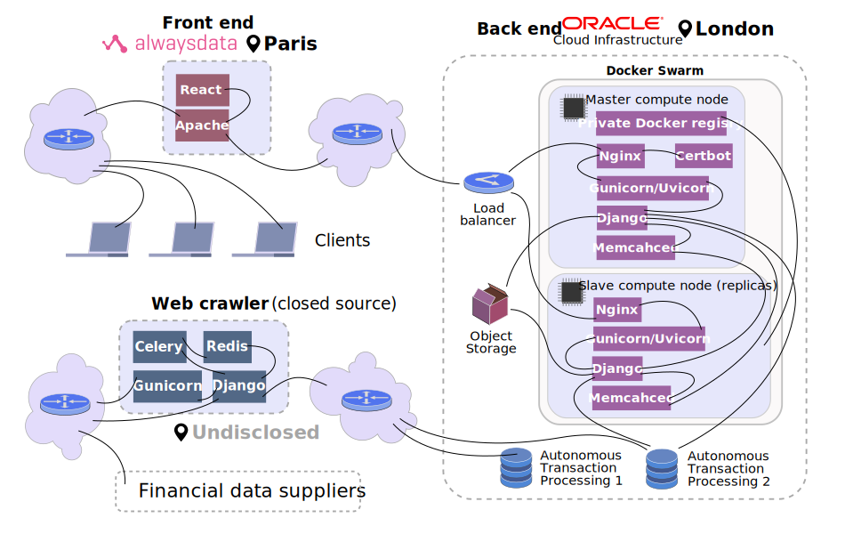

# Financial analysis

[Website](https://finance.mishurov.co.uk)'s source code. The website uses a [React](https://reactjs.org) (with [D3](https://d3js.org) for interactive charting) single-page application as a web-client and a [Django](https://www.djangoproject.com) project as a back-end server.

## Deployment

There're two nice cyber-shelters for cyber-homeless: [Alwaysdata](https://www.alwaysdata.com/en/) and [Oracle](https://www.oracle.com/cloud/). Both have their limitations in their free plans. The crucial ones: **Alwaysdata** has limited storage and **Oracle has** limited bandwidth. In order to utilise more efficiently the resources, I use the following deployment architecture:

It also includes [Terraform](https://www.terraform.io) configuration files to manage the Oracle Cloud resources.

There're also [Kubernetes](https://kubernetes.io) deployment files, locally, using [MicroK8s](https://microk8s.io), it works fine but on the free-tier cloud virtual hardware goes almost irresponsive, gorges too much CPU.

### Oracle
>In support of Oracle employees and customers in Ukraine, Oracle has withdrawn all operations in the Russian Federation and Belarus.

In support of myself in Russia, I have withdrawn the back end of this project from Oracle Cloud Infrastructure and temporarily deployed it to Heroku.
